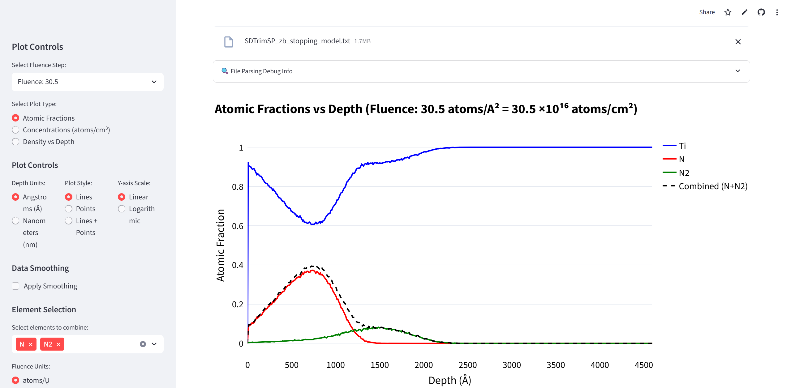
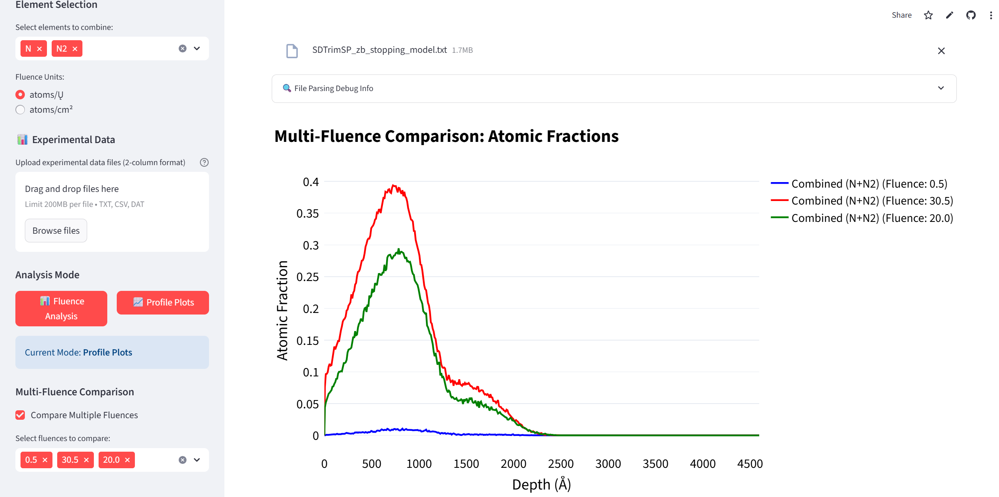
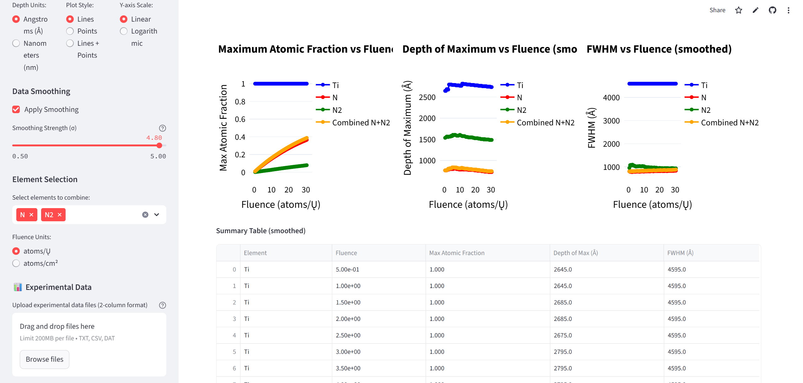

# sdtrimsp-output-plot
SDTrimSP output analysis of depth distributions for simulations of ion implantation. Try the application online at: http://sdtrimsp.streamlit.app/

### **Compile the app locally** 

Open your terminal console and write the following commands (the bold text):  
(Optional) Install Git:  
      **sudo apt update**  
      **sudo apt install git**    
      
1) Download the app code from GitHub (or download it manually without Git on the following link by clicking on 'Code' and 'Download ZIP', then extract the ZIP. With Git, it is automatically extracted):  
      **git clone https://github.com/bracerino/sdtrimsp-output-plot.git**

2) Navigate to the downloaded project folder:  
      **cd sdtrimsp-output-plot/**

3) Create a Python virtual environment to prevent possible conflicts between packages:  
      **python3 -m venv sdtrimsp_env**

4) Activate the Python virtual environment (before activating, make sure you are inside the sdtrimsp-output-plot folder):  
      **source sdtrimsp_env/bin/activate**
   
5) Install all the necessary Python packages:  
      **pip install -r requirements.txt**

6) Run the app (always before running it, make sure to activate its Python virtual environment (Step 4):  
      **streamlit run app.py**
7) To update the application, write in the main folder:  
      **git pull**

